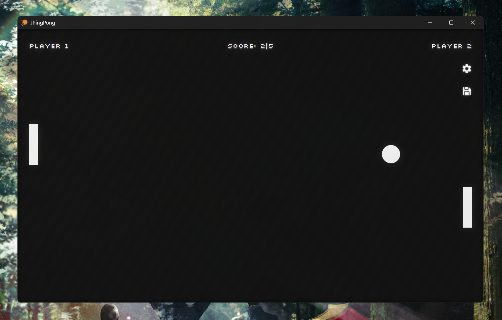

<h1>
    
    JPingPong
</h1>

**JPingPong** (aka Java Ping-Pong) is a more modern “replica” of the famous game
[Pong developed by Atari in 1972](https://en.wikipedia.org/wiki/Pong) on Java using JavaFX, developed as part of a student project.



At present, _the game is in active development_ and does not meet ALL of its functional requirements to be released (but **it's already playable :O**).

## Requirements (from or higher)
- **[JDK21](https://adoptium.net/en-GB/temurin/releases?version=21&os=any&arch=any)**
- JavaFX21 (i.e., compatible with JDK)
- Maven 3.9
- JUnit 5.10 (Jupiter)

> [!NOTE]
> Only JDK is required, every other dependencies could be handled using maven wrapper.

## Build & Run
**First**, _navigate to the desired folder through the terminal_,
```
cd [your-path]
```
then _clone the repository using **[git](https://git-scm.com/install/windows)**_:
```
git clone https://github.com/Tekisho/JPingPong
```

**Finally**, to _download all dependencies_ required & build the project _use maven wrapper script_:
```
./mvnw clean install
```

and to **run the game** use:
```
./mvnw javafx:run
```

> [!IMPORTANT]
> If you are trying to run the game through IDE (e.g., IntelliJ IDEA), then to fix issues with the [dark theme](https://www.pixelduke.com/fxthemes/) add next VM options:
> ```
> -Dprism.forceUploadingPainter=${forceUploadingPainter} --add-opens javafx.graphics/javafx.stage=com.pixelduke.fxthemes --add-exports javafx.graphics/com.sun.javafx.tk.quantum=com.pixelduke.fxthemes
> ```

## Controls
* `W`, `S` (or according `ARROW` keys) to move racket UP or DOWN
* `R` to trigger "fast restart" of the game
* `P` to activate pause
* `ESC` to show settings window, automatically puts game on pause

## Features
* Adaptive UI, Dark theme
* Keyboard controls
* Basic physics (i.e., velocity, bouncing & collisions)
* Bot (single-player) opponent
* Score system
* Ball speed-up (after each 2nd racket bounce)
* Game settings
* Pause, Fast Restart, Game Over

## Roadmap (in progress :O)
* [ ] Delta time
* [ ] Proper Physics
  * [ ] multiple collisions detection
  * [ ] overlapping (aka stuck) collisions resolving
  * [ ] velocity (vectors related)
  * [ ] bouncing (angles related)
* [ ] Settings
  * [X] basics
  * [ ] reset to defaults
  * [ ] user input validation
  * [ ] scroll
* [ ] SFXs
* [ ] Random Event System

## Contributing
Pull requests are very welcome :3. For major changes, please open an issue first
to discuss what you would like to change.

## License
This project is under [MIT license](https://choosealicense.com/licenses/mit/). Please familiarize yourself with [license file](LICENSE.md) for more information.
