# Architecture

## Overview
The project developed in **layered architecture style**, it uses **the MVC architectural pattern (Apple version)**, primarily for educational purposes, although 
there is one advantage to this approach: despite the fact that the Controller is closely coupled with the View, the View (through delegation) and Model (simply, have no knowledge) are separated from it and each other, 
which I find quite convenient and moreover, the View contain no business logic of its own (aka [Passive View](https://martinfowler.com/eaaDev/PassiveScreen.html)).

## Class Diagram

```mermaid
classDiagram

class ApplicationController {
    +initApplication(primaryStage) void
}
ApplicationController*--StageManager
ApplicationController*--ViewManager
ApplicationController*--RouteManager
ApplicationController*--GameModel
ApplicationController*--GameController
ApplicationController*--SettingsController
ApplicationController*--GameView
ApplicationController*--SettingsView
ApplicationController*--SaveLoadController
ApplicationController*--SaveLoadView
ApplicationController*--DatabaseManager
ApplicationController*--SerializationService
ApplicationController*--SyncService


class StageManager {
    +setupStages(initialPrimaryView, initialSecondaryView) void
}

class ViewManager {
    +registerView(viewType, view) void
    +getView(viewType) View
}

class RouteManager {
    +route(fromStage, toViewType) void
}
RouteManager..>StageManager
RouteManager..>ViewManager


class ViewDelegate <<interface>>

class GameViewDelegate <<interface>> {
    +handleViewResize(w, h) void
    +handleResetAndRestartGame() void
    +handleResumeGame() void
    +handleOpenSettingsRequest() void
    +handleStartGame() void
}
ViewDelegate <|-- GameViewDelegate

class SettingsViewDelegate <<interface>> {
    +handleApplySettingsChanges() void
    +handleGamePauseAndContinuation() void
}
ViewDelegate <|-- SettingsViewDelegate

class SaveLoadViewDelegate <<interface>> {
    +handleSaveCurrent() void
    +handleLoadLast() void
}
ViewDelegate <|-- SaveLoadViewDelegate

class GameController
GameController..|>GameViewDelegate
GameController..|>Observer
GameController..>GameModel
GameController..>GameView

class SettingsController
SettingsController..|>SettingsViewDelegate
SettingsController..|>Observer
SettingsController..>GameModel
SettingsController..>SettingsView

class SaveLoadController
SaveLoadController..|>SaveLoadViewDelegate
SaveLoadController..>SyncService
SaveLoadController..>GameModel
SaveLoadController..>SaveLoadView


class View<<interface>> {
    +setDelegate(delegate) void
    +setupEventHandlers() void
}
View..>ViewDelegate
GameView..|>View
SettingsView..|>View
SaveLoadView..|>View

class GameView
GameView*--GameObjectViewComponent

class SettingsView

class SaveLoadView


class Renderable<<interface>> {
    +render(x, y, width, height, fillColor) void
}
class GameObjectViewComponent
GameObjectViewComponent..|>Renderable


class Subject<<interface>> {
    +attachObserver(observer) void
    +detachObserver(observer) void
    +notifyAllObservers() void
}
Subject..>Observer

class Observer {
    +update() void
}


class GameModel {
    -createGameLoop() void
    -updateGame(now, activeKeys) void
    +switchGameState(state) void
}
GameModel..|>Subject
GameModel o-- Observer
GameModel*--GameState
GameModel*--PlayerModel
GameModel*--BallModel


class GameState {
    <<enumeration>>
    AWAITING_STARTUP
    RUNNING
    PAUSED
    OVER
    RESTARTING
}


class PlayerModel {
    -name String
    -score int
}
PlayerModel*--RacketModel

class GameObjectModel<<abstract>> {
    -x double
    -y double
    -width double
    -height double
    -basicVelocity double
    -velocity double
    -dx double
    -dy double
    -color Color
}
GameObjectModel<|--BallModel
GameObjectModel<|--RacketModel

class BallModel
class RacketModel

class DatabaseManager {
    +getConnection() Connection
}

class SerializationService {
    +getGameDTO() GameDTO
    +getFirstPlayerDTO() PlayerDTO
    +getSecondPlayerDTO() PlayerDTO
}
SerializationService..>GameModel
SerializationService..>GameDTO

class GameDTO {
    -gameEndScore int
}
GameDTO *-- PlayerDTO

class PlayerDTO {
    -name String
    -score int
}

class SyncService {
    +saveSessionState() void
    +restoreLastSessionState() GameModel
}
SyncService..>DatabaseManager
SyncService..>SerializationService
SyncService*--GameDAO

class Dao<<interface>> {
    +get(id) T
    +getAll() List~T~
    +save(t) void
    +update(t) void
    +delete(t) void
}

class GameDAO<<record>>
GameDAO..|>Dao
GameDAO..>DatabaseManager
```
